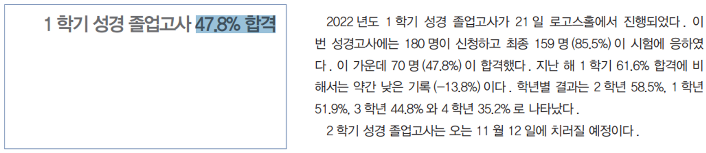

## 소개

한국성서대학교 재학생들의 성경 졸업고사를 사전에 대비하고자 만든 퀴즈 형태의 모바일 애플리케이션입니다. 2주 안팎에 준비해야한다는 조급함과 낮은 합격률은 학습에 거부감을 생기게하는데 이를 해결합니다.

## 참고문헌

[kokos 성경 졸업고사 합격률, 2022년 6월호, 7면](https://stor.bible.ac.kr/kokkos/2022/2022-06_KOKKOS.pdf)